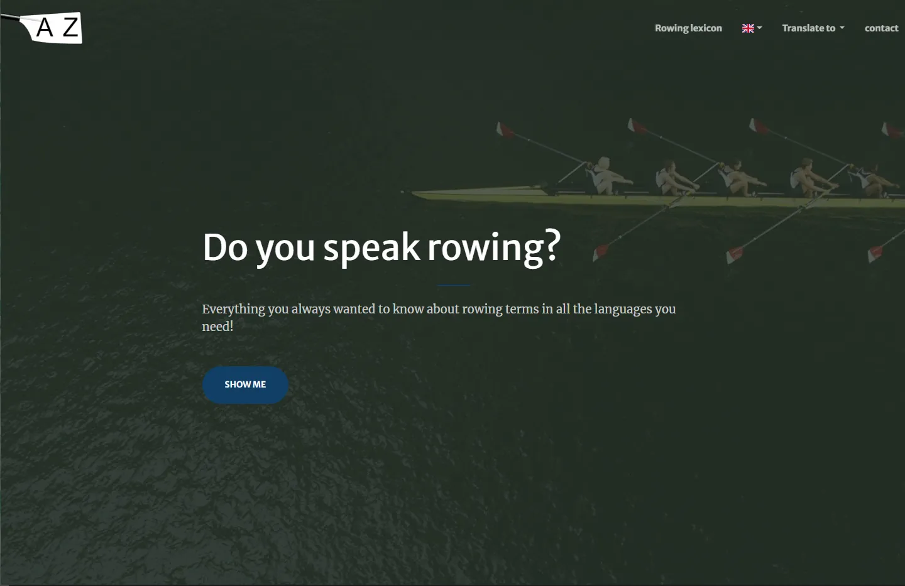

# [Bootstrap - Multilingual glossary](https://doyouspeakrowing.github.io/www/)

[Multilingual glossary](https://doyouspeakrowing.github.io/www) is a one page, website theme built with [Bootstrap](https://getbootstrap.com/) to present a glossary in multiple languages

## Preview

**[View Live Preview](https://doyouspeakrowing.github.io/www)**

## Status

## Download and Installation

To begin using this template, choose one of the following options to get started:

- Install using npm: `npm i doyouspeakrowing`
- Clone the repo: `git clone https://github.com/DoYouSpeakRowing/www.git`
- [Fork, Clone, or Download on GitHub](https://github.com/DoYouSpeakRowing/www)

## Usage

### Basic Usage

After downloading, simply edit the HTML and CSS files included with `dist` directory. These are the only files you need to worry about, you can ignore everything else! To preview the changes you make to the code, you can open the `index.html` file in your web browser.

### Advanced Usage

Clone the source files of the theme and navigate into the theme's root directory. Run `npm install` and then run `npm start` which will open up a preview of the template in your default browser, watch for changes to core template files, and live reload the browser when changes are saved. You can view the `package.json` file to see which scripts are included.

#### npm Scripts

- `npm run build` builds the project - this builds assets, HTML, JS, and CSS into `dist`
- `npm run build:assets` copies the files in the `src/assets/` directory into `dist`
- `npm run build:pug` compiles the Pug located in the `src/pug/` directory into `dist`
- `npm run build:scripts` brings the `src/js/scripts.js` file into `dist`
- `npm run build:scss` compiles the SCSS files located in the `src/scss/` directory into `dist`
- `npm run clean` deletes the `dist` directory to prepare for rebuilding the project
- `npm run start:debug` runs the project in debug mode
- `npm start` or `npm run start` runs the project, launches a live preview in your default browser, and watches for changes made to files in `src`
You must have npm installed in order to use this build environment.

#### Adding new languages

It is very easy to add new languages in this glossary simply add a .csv file in the src folder. here are examples of this file for [english](https://github.com/DoYouSpeakRowing/www/blob/main/src/dico-en-gb.csv) or [french](https://github.com/DoYouSpeakRowing/www/blob/main/src/dico-fr.csv). Note that the file naming convention is either dico-\<language\>-\<country\>.csv or dico-\<language\>.csv (based on iso 639 language codes and iso 3166 country codes). Use the former (e.g dico-en-gb.csv) when country and language code differ and the latter when they are the same (e.g dico-fr.csv). The country code is used to detemine the flag in language selection dropdown. 

## Bugs and Issues

Have a bug or an issue with this template? [Open a new issue](https://github.com/DoYouSpeakRowing/www/issues) here on GitHub.

## About

This theme is an open source library and is released under the MIT license, which means you can use it for any purpose, even for commercial projects.

It is based on the [Bootstrap](https://getbootstrap.com/) framework created by [Mark Otto](https://twitter.com/mdo) and [Jacob Thorton](https://twitter.com/fat).
It was derived from [StartBootstrap creative](https://github.com/StartBootstrap/startbootstrap-creative) created by [David Miller](https://davidmiller.io/)
The csv to json conversion code in js is re-used from [Flatfile](https://csvjson.com/)

## Rowing glossary content

The rowing terms published in this theme have been consolidated from the following sources:
- source1
- source 2 ...

## Copyright and License

Copyright 2022 DoyouspeakRowing. Code released under the [MIT](https://raw.githubusercontent.com/DoYouSpeakRowing/www/main/LICENSE) license.
